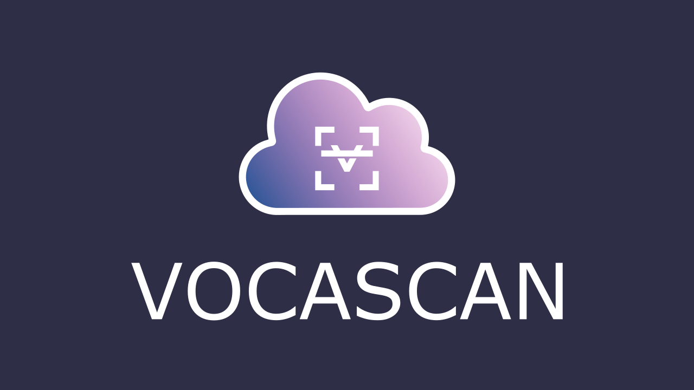

# Vocascan

## Table of Contents

Finally the time has come. The first release of Vocascan is ready. Vocascan is a server-client vocabulary trainer that is intended to give the user many setting options so that he can adapt it to his personal learning strategies and habits. All the basic functions of a vocabulary trainer are currently built in, making it fully functional. However, there are still many more features to come. Due to the data protection guidelines, we cannot yet provide a public server, which means that you currently have to host it yourself. But we are working as quickly as possible to use the trainer offline.

  \- [Table of Contents](#table-of-contents)

  \- [Installation](#installation)

  \- [Usage](#usage)

  \- [Support](#support)

  \- [Contributors](#contributors)

## Installation

Please refer to our official [docs](https://vocascan.github.io/documentation/#/vocascan-desktop/installation)

## Usage

Nothing provided yet

## Support

Please [open an issue](https://github.com/vocascan/vocascan-desktop/issues/new) for support.
For questions or ideas please use [Discussions](https://github.com/vocascan/vocascan-desktop/discussions)

## Contributors

