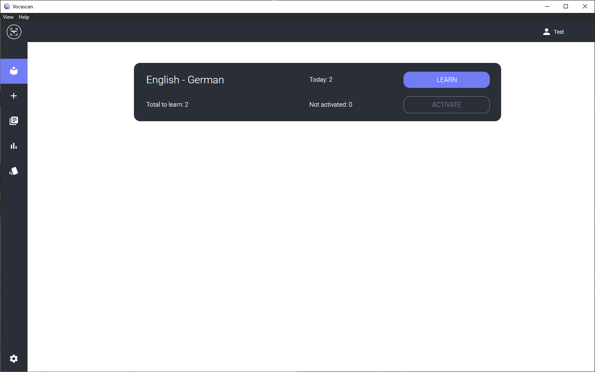
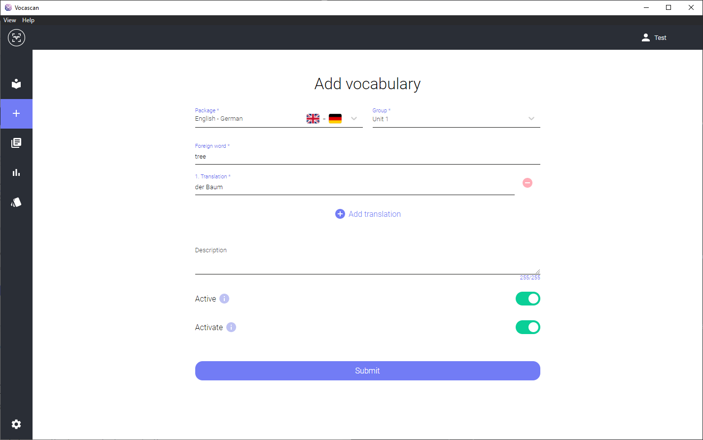
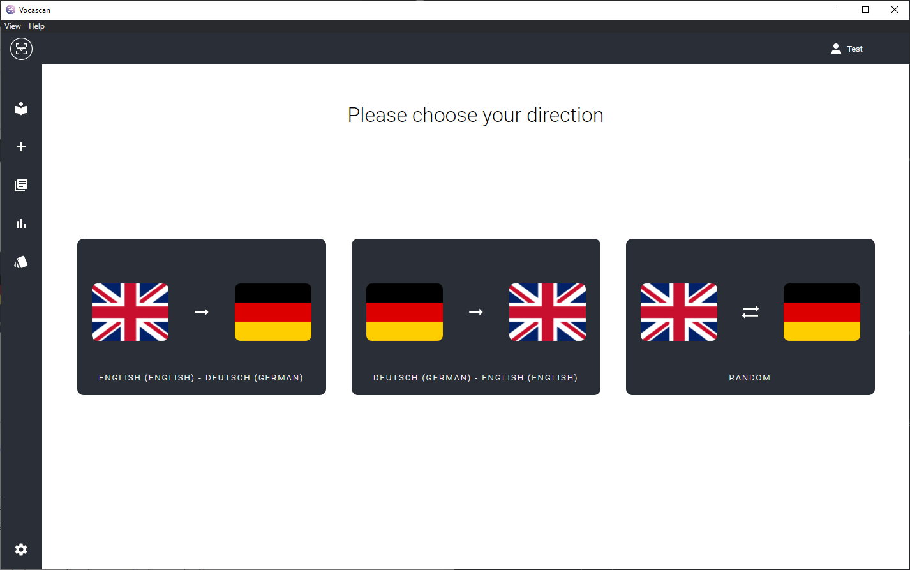
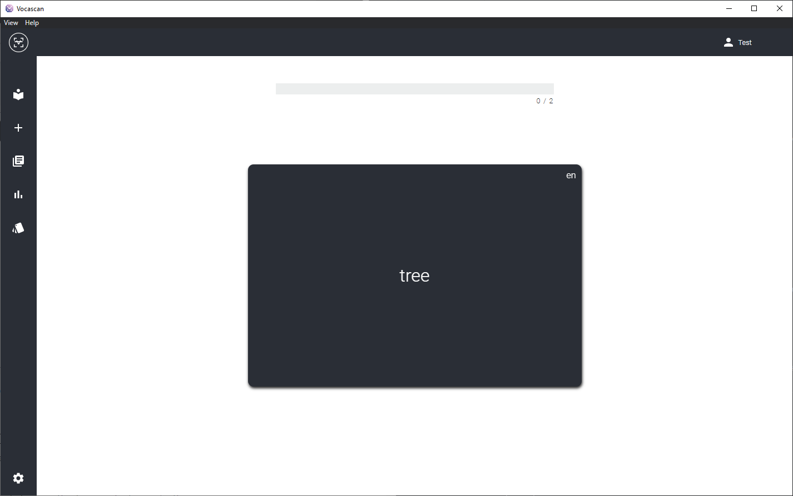
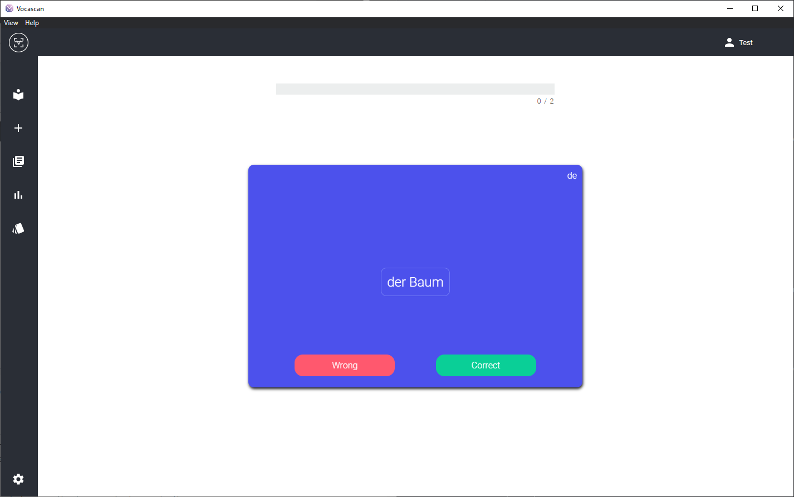

<!--
*** Thanks for checking out the Best-README-Template. If you have a suggestion
*** that would make this better, please fork the repo and create a pull request
*** or simply open an issue with the tag "enhancement".
*** Don't forget to give the project a star!
*** Thanks again! Now go create something AMAZING! :D
-->

<!-- PROJECT SHIELDS -->
<!--
*** I'm using markdown "reference style" links for readability.
*** Reference links are enclosed in brackets [ ] instead of parentheses ( ).
*** See the bottom of this document for the declaration of the reference variables
*** for contributors-url, forks-url, etc. This is an optional, concise syntax you may use.
*** https://www.markdownguide.org/basic-syntax/#reference-style-links
-->

<!-- PROJECT LOGO -->
 

  

  

    A highly configurable vocab trainer
     
     
    <a href="https://github.com/vocascan/vocascan-desktop/issues/new">Report Bug</a>
    ·
    <a href="https://github.com/vocascan/vocascan-desktop/discussions">Request Feature</a>
    ·
    <a href="https://docs.vocascan.com">Docs</a>
    ·
    <a href="https://discord.vocascan.com">Discord</a>
  

<!-- ABOUT THE PROJECT -->

## About The Project

Digitalization is creating a huge change in the world. We no longer only have the chance to communicate with our fellow human beings in the vicinity, but to interact quickly and easily around the entire globe. Language is our most important medium, which helps us to interact with the other person. A common language helps to make life easier and to break barriers. That's why we founded Vocascan, a server-client based open-source vocabulary trainer. We believe that everyone should have the chance to learn another language for free and in their own way. Based on the ever-proven principle of flashcards, we have developed a highly configurable trainer that has many settings to adapt it to your learning methods and strategies.

### Core Features

- 📚 **Learn your vocabs** very easily
- ☁️ **Synchronized** with any device
- 👪 **Share** vocabs with your friends

### Built With

<!-- GETTING STARTED -->

## Getting Started

To use Vocascan Desktop you currently need a running Vocascan server. To learn more about this visit the [documentation](https://docs.vocascan.com/#/vocascan-server/installation/installation).

Now let's move on to the installation of the desktop app itself.
Currently, depending on the operating system, there are several ways to install it.

1. [Installer](https://docs.vocascan.com/#/vocascan-desktop/installation?id=_1-installer)
2. [Snap Store](https://docs.vocascan.com/#/vocascan-desktop/installation?id=_2-snap-store) (Linux)
3. [Self-build](https://docs.vocascan.com/#/vocascan-desktop/installation?id=_3-build-vocascan-yourself)

If any questions have come up, it's best to check out our [FAQ](https://docs.vocascan.com/#/general/faq). If they are still not answered, feel free to contact a maintainer. Check the [contact](#contact) section for more information

<!-- USAGE EXAMPLES -->

## Usage

 

  
More Images

  
  
  
  

 

_For a better guide to the functions, please refer to the [Documentation](https://docs.vocascan.com/#/vocascan-desktop/intro)._

<!-- ROADMAP -->

## Roadmap

- [ ] Theming
- [ ] Outsource Frontend as a website

See the [project board](https://github.com/vocascan/vocascan-desktop/projects/1) for a full list of proposed features (and known issues).

<!-- CONTRIBUTING -->

## Contributing

Contributions are what make the open source community such an amazing place to learn, inspire, and create. Any contributions you make are **greatly appreciated**.

For a more detailed instruction about contributing visit our [contribution docs](https://docs.vocascan.com/#/vocascan-desktop/contribute).

<!-- LICENSE -->

## License

Distributed under the Apache 2 License. See `LICENSE` for more information.

<!-- CONTACT -->

## Contact

Vocascan - [@vocascan](https://twitter.com/vocascan) - vocascan@gmail.com - [Discord](http://discord.vocascan.com)

Project Link: [https://github.com/vocascan/vocascan-desktop](https://github.com/vocascan/vocascan-desktop)
